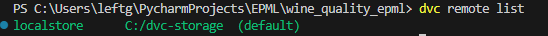
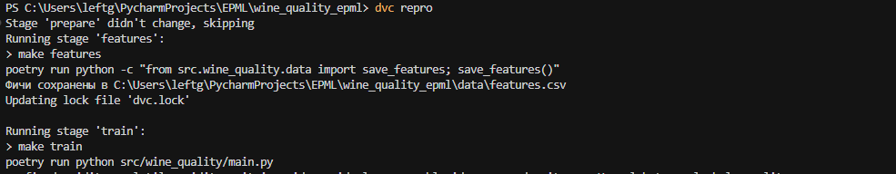
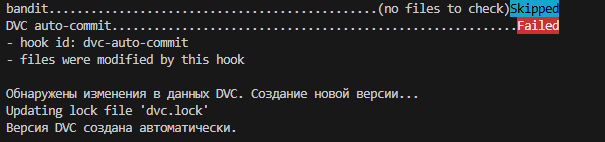
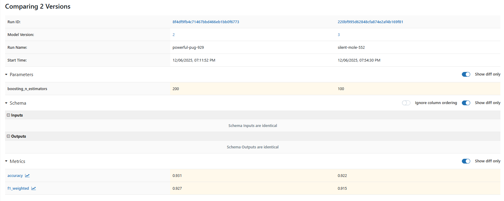

# Отчет по проделанной работе

## Выбранные инструменты

### Для версионирования данных
**DVC (Data Version Control)**

### Для версионирования моделей
**MLflow (Model Registry)**

---

## 1. Настройка DVC для версионирования данных (4 балла)

### a)
DVC установлен через Poetry и добавлен в зависимости:
```
dvc = "^3.64.0"
```

### b)
Настроено локальное хранилище для DVC.

### c)
Создан DVC pipeline в `dvc.yaml`:
```
stages:
  prepare:
    cmd: make prepare
    outs:
      - data

  train:
    cmd: make train
    deps:
      - src/wine_quality/main.py
      - data
```


### d)
Настроен pre-commit hook для автоматического создания версий DVC. В `.pre-commit-config.yaml`:
```
- repo: local
  hooks:
    - id: dvc-auto-commit
      name: DVC auto-commit
      entry: bash -c 'dvc_status=$(dvc status 2>&1); if echo "$dvc_status" | grep -q "changed"; then echo "Обнаружены изменения в данных DVC. Создание новой версии..."; dvc commit -f; echo "Версия DVC создана автоматически."; fi'
      language: system
      pass_filenames: false
      always_run: true
      stages: [post-commit]
```

---

## 2. Настройка MLflow для версионирования моделей (3 балла)

### a)
MLflow установлен через Poetry:
```
mlflow = "^3.6.0"
```

MLflow Tracking Server настроен в `Makefile`:
```
mlflow:
	mlflow server --backend-store-uri sqlite:///mlflow.db --default-artifact-root ./artifacts --host 127.0.0.1 --port 5000
```

В коде обучения настроен tracking URI:
```
mlflow.set_tracking_uri("http://127.0.0.1:5000")
```

### b)
Реализован модуль `src/wine_quality/mlflow_registry.py` с функциями:
- `ensure_experiment()` - создание и переключение между экспериментами
- `register_model_from_run()` - регистрация модели из MLflow run
- `transition_model_stage()` - управление стадиями модели
- `set_model_version_tags()` - установка метаданных для версий
- `list_model_versions()` - получение списка версий
Модели регистрируются автоматически при обучении через `run_experiment()` в `model.py`.

### c)
Метаданные логируются через `log_metadata()` в `mlflow_registry.py`. Для каждой версии устанавливаются теги через `set_model_version_tags()` с информацией о типе модели, параметрах, метриках и стадии.


### d)
Модели можно сравнивать в ui mlflow



## 3. Воспроизводимость (2 балла)

### a)
Инструкции по воспроизведению описаны в `README.MD`:
- `make install` - установка зависимостей
- `make prepare` - подготовка данных
- `make train` - обучение модели
- `make mlflow` - запуск MLflow сервера
- `make streamlit` - запуск Streamlit приложения
- `docker compose up --build` - запуск в Docker

### b)
Версии зависимостей зафиксированы в `pyproject.toml` через Poetry. Файл `poetry.lock` содержит точные версии всех зависимостей.

### c)
Воспроизводимость обеспечивается через:
- Фиксацию `random_state` в конфигурации
- Использование Poetry для управления зависимостями
- Версионирование данных через DVC
- Логирование всех параметров и метрик в MLflow

### d)

модифицирован докер файл для того, чтобы поддерживать dvc

Создан Docker контейнер. `dockerfile`:
```
FROM python:3.13-slim

RUN apt-get update && apt-get install -y --no-install-recommends \
    build-essential \
    gcc \
    git \
 && rm -rf /var/lib/apt/lists/*

ENV POETRY_VERSION=1.8.3
RUN pip install "poetry==$POETRY_VERSION"
ENV POETRY_VIRTUALENVS_CREATE=false
ENV POETRY_NO_INTERACTION=1

WORKDIR /app
COPY pyproject.toml poetry.lock* ./
RUN poetry install --only main --no-ansi

COPY . .

RUN dvc remote modify localstore url /dvc-storage || \
    dvc remote add localstore /dvc-storage || true

RUN dvc pull || true

CMD ["streamlit", "run", "src/wine_quality/app.py", "--server.port=8501", "--server.address=0.0.0.0"]
```

`docker-compose.yaml`:
```
version: "3.9"

services:
  wine-app:
    build:
      context: .
      dockerfile: Dockerfile
    container_name: wine_quality_app
    ports:
      - "8501:8501"
    volumes:
      - .:/app
      - C:/dvc-storage:/dvc-storage
    restart: unless-stopped
```

---

## 4. Подготовлен отчет
Настоящий документ является финальным отчетом.
