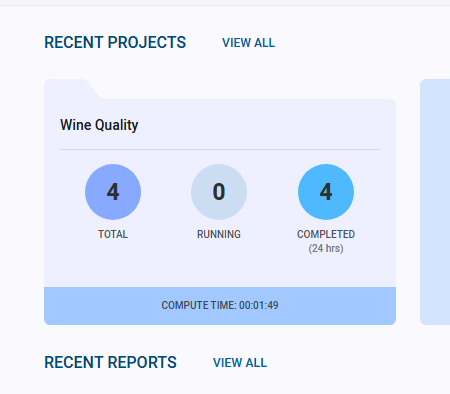
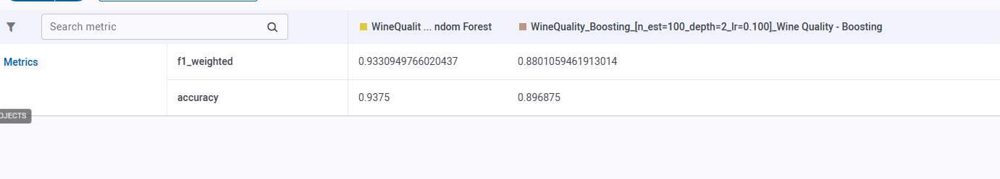
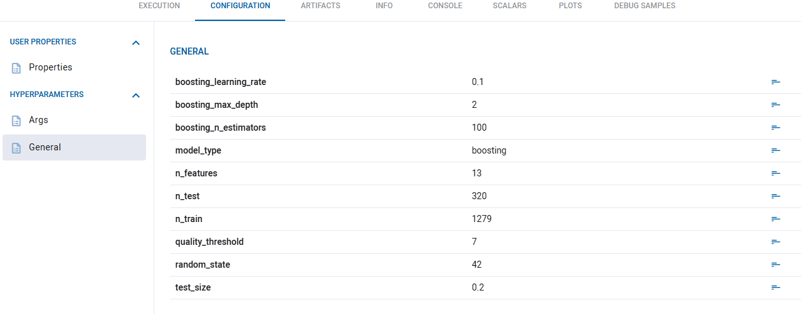
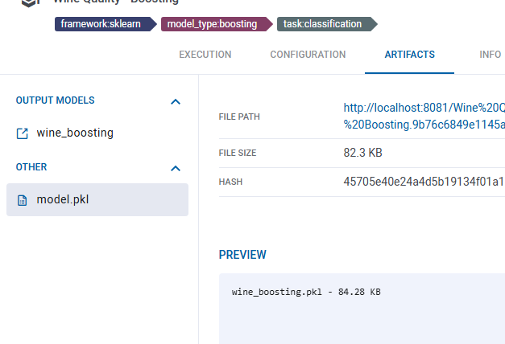
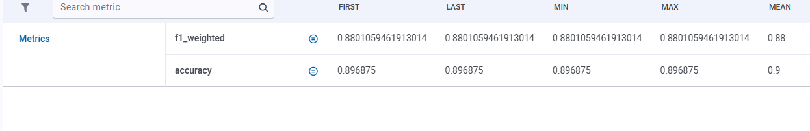
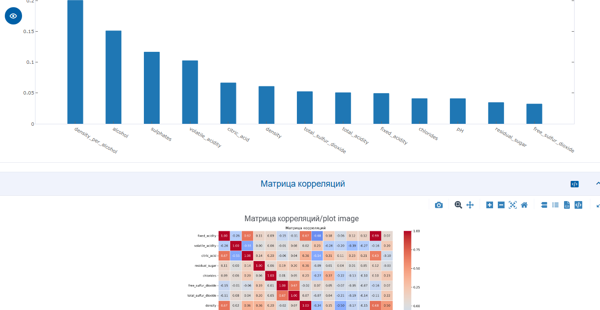
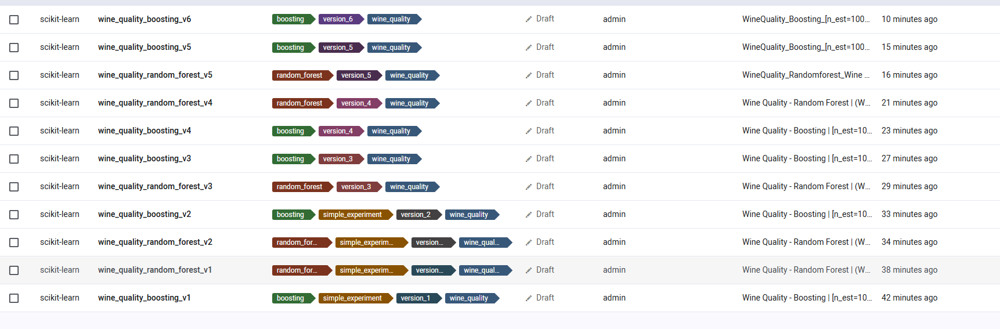
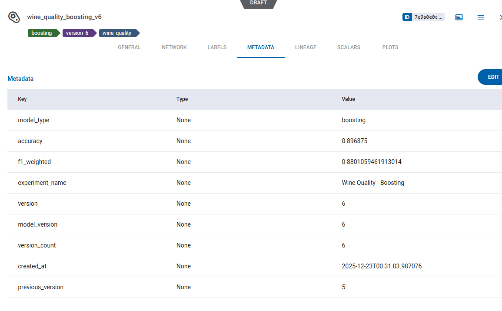
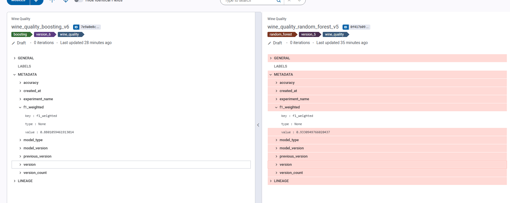
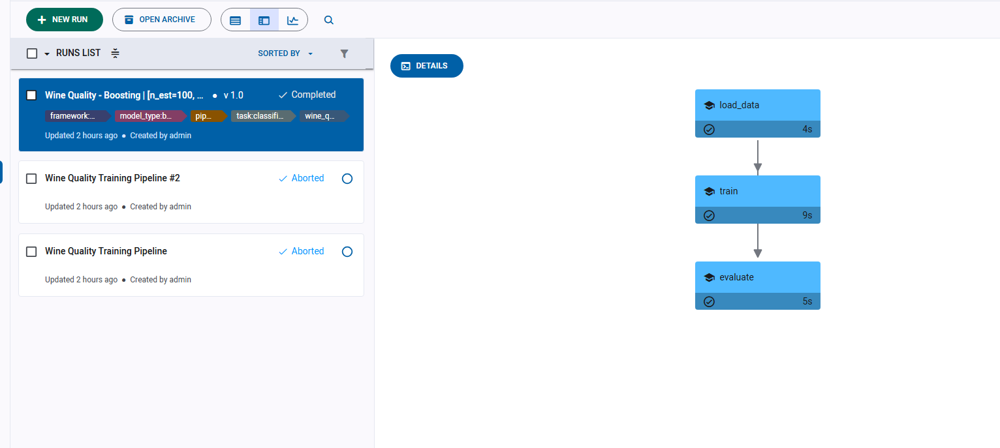

# Отчет по проделанной работе: Интеграция ClearML

## Выбранный инструмент

Для трекинга экспериментов, управления моделями и создания пайплайнов выбран **ClearML**.

---

## 1. Настройка ClearML (3 балла)

### a) Установить и настроить ClearML Server

ClearML Server настроен через Docker Compose в `clearml-server/docker-compose.yml`. Сервер включает:
- **MongoDB** - база данных для хранения метаданных
- **Redis** - кэш и очередь задач
- **Elasticsearch** - поиск и индексация
- **API Server** - REST API для взаимодействия
- **File Server** - хранилище файлов и артефактов
- **Web Server** - веб-интерфейс на порту 8080

ClearML установлен как зависимость в `pyproject.toml`:
```toml
clearml = "^1.15.0"
```


### b) Настроить базу данных и хранилище

База данных MongoDB настроена с персистентными томами:
- `mongo_data` - данные MongoDB
- `mongo_config` - конфигурация MongoDB
- `clearml_data` - хранилище файлов и артефактов
- `clearml_logs` - логи сервера
- `clearml_config` - конфигурация ClearML

### c) Создать проект и эксперименты

Проект "Wine Quality" создан и используется во всех модулях. Эксперименты создаются автоматически через контекстный менеджер `ClearMLTaskContext` в `src/wine_quality/clearml_context.py`:

```python
class ClearMLTaskContext:
    """Контекстный менеджер для работы с задачами ClearML."""

    def __enter__(self) -> ClearMLTaskContext:
        self.task = Task.init(
            project_name=self.project_name,
            task_name=self.task_name,
            task_type=self.task_type,
            auto_connect_frameworks=True,
            auto_connect_streams=True,
        )
        return self
```

Конфигурация проекта находится в `conf/clearml/clearml.yaml`:
```yaml
project_name: "Wine Quality"
task_type: "training"
auto_connect_frameworks: true
auto_connect_streams: true
```

### d) Настроить аутентификацию

Аутентификация настроена через фиксированных пользователей в docker-compose:
```yaml
CLEARML__APISERVER__AUTH__FIXED_USERS__ENABLED: true
CLEARML__APISERVER__AUTH__FIXED_USERS__PASS_HASHED: false
CLEARML__APISERVER__AUTH__FIXED_USERS__USERS: '[{"username": "admin", "password": "${ADMIN_PASSWORD}", "name": "admin"}]'
```

Пароль администратора задается через переменную окружения `ADMIN_PASSWORD`.

---

## 2. Трекинг экспериментов (3 балла)

### a) Настроить автоматическое логирование

Автоматическое логирование реализовано в модуле `src/wine_quality/clearml_utils.py`:

- **Логирование параметров:** `log_params_to_clearml()` - логирует параметры через `task.connect()`
- **Логирование метрик:** `log_metrics_to_clearml()` - логирует метрики через `task.logger.report_scalar()`
- **Логирование графиков:** `log_plot_to_clearml()` - логирует графики через `task.logger.report_image()`
- **Логирование артефактов:** `log_artifact_to_clearml()` - логирует артефакты через `task.upload_artifact()`

### b) Создать систему сравнения экспериментов


Система сравнения реализован внутри ui clearml, а также через функцию `compare_clearml_models()` в `clearml_utils.py`. Функция сравнивает версии модели по метрикам и определяет лучшую версию.


### c) Настроить логирование метрик и параметров

Логирование метрик и параметров интегрировано во все компоненты пайплайна в `clearml_pipeline.py`:
- В компоненте загрузки данных логируются размеры выборок и количество признаков
- В компоненте обучения логируются метрики (accuracy, f1_weighted) и параметры модели
- В компоненте оценки логируются итоговые метрики








### d) Создать дашборды для анализа

Дашборды доступны через ClearML Web UI на порту 8080. Все метрики автоматически отображаются:
- Скалярные метрики через `task.logger.report_scalar()`
- Изображения через `task.logger.report_image()`
- Таблицы через `task.logger.report_table()`
- Confusion matrix через `task.logger.report_confusion_matrix()`

---

## 3. Управление моделями (3 балла)

### a) Настроить регистрацию и версионирование моделей

Регистрация и версионирование реализованы в `log_model_to_clearml()` в `clearml_utils.py`. Функция автоматически определяет следующую версию модели через `get_model_version_info()`, которая ищет все версии модели в проекте и инкрементирует версию.

Модели регистрируются через `register_model_with_version()` в `clearml_model_registry.py`, который оборачивает `log_model_to_clearml()`.



### b) Создать систему метаданных для моделей

Метаданные сохраняются при регистрации модели через `output_model.set_metadata()`. Метаданные включают:
- Номер версии и количество версий
- Время создания
- Предыдущую версию
- Тип модели
- Метрики производительности (accuracy, f1_weighted)
- Имя эксперимента

### c) Настроить автоматическое создание версий

Автоматическое создание версий работает через параметр `auto_version=True` в `register_model_with_version()`. Версии инкрементируются автоматически: `wine_quality_boosting_v1`, `wine_quality_boosting_v2`, и т.д.

### d) Создать систему сравнения моделей

Система сравнения реализована в ui, а такеже функциями `compare_clearml_models()` и `get_model_comparison()` в `clearml_model_registry.py`.


---

## 4. Пайплайны (2 балла)

### a) Создать ClearML пайплайны для ML workflow

Полный пайплайн реализован в `src/wine_quality/clearml_pipeline.py`:

```python
@PipelineDecorator.pipeline(
    name="Wine Quality Training Pipeline",
    project="Wine Quality",
    version="1.0",
)
def wine_quality_pipeline(...) -> dict[str, Any]:
    data_path = load_and_prepare_data(...)
    results_path = train_model_component(...)
    evaluation_path = evaluate_model_component(...)
    return evaluation_results
```

Пайплайн состоит из трех компонентов:
1. **`load_and_prepare_data()`** - загрузка и подготовка данных
2. **`train_model_component()`** - обучение модели с регистрацией в ClearML
3. **`evaluate_model_component()`** - оценка модели

Каждый компонент декорирован `@PipelineDecorator.component()` и может выполняться независимо.

### b) Настроить автоматический запуск пайплайнов

Пайплайн запускается через скрипт `run_clearml_pipeline.py` с поддержкой аргументов командной строки для всех параметров. Пайплайн можно запустить:
- **Локально** - через `PipelineDecorator.run_locally()`
- **Удаленно** - через ClearML Web UI (запуск на агенте)

### c) Создать систему мониторинга выполнения

Система мониторинга реализована через класс `NotificationSystem` в `clearml_pipeline.py`. Класс предоставляет методы:
- `notify_success()` - уведомление об успешном выполнении
- `notify_failure()` - уведомление об ошибке
- `notify_completion()` - итоговое уведомление с метриками

### d) Настроить уведомления

Уведомления настроены через класс `NotificationSystem` с поддержкой:
- **Консольных уведомлений** - логирование через `logger`
- **Email уведомлений** - через SMTP
Уведомления интегрированы в пайплайн и отправляются при успешном завершении или ошибке.

---

## Структура проекта

```
src/wine_quality/
├── clearml_context.py          # Контекстный менеджер для задач ClearML
├── clearml_utils.py            # Утилиты для логирования в ClearML
├── clearml_model_registry.py   # Регистрация и версионирование моделей
└── clearml_pipeline.py          # ClearML пайплайн с компонентами

clearml-server/
└── docker-compose.yml           # Конфигурация ClearML Server

conf/clearml/
└── clearml.yaml                 # Конфигурация проекта

run_clearml_pipeline.py         # Скрипт запуска пайплайна
```

---

## Итоги

Настоящий документ является финальным отчетом.
