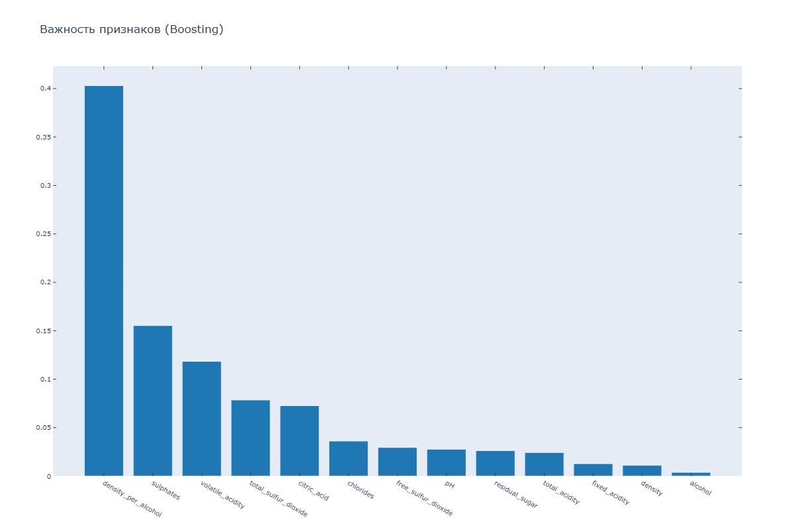
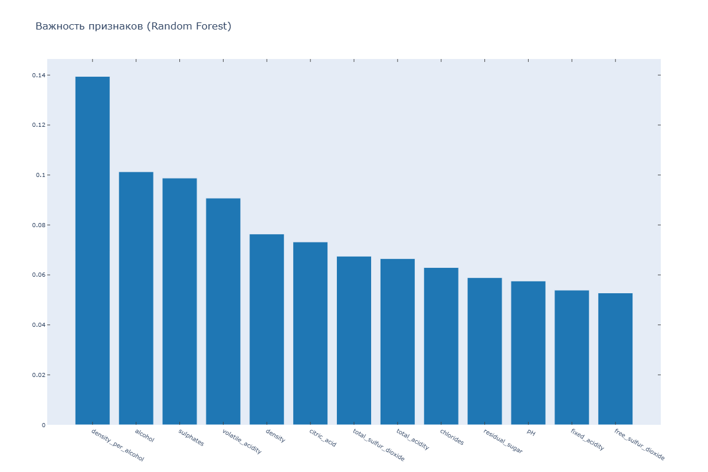
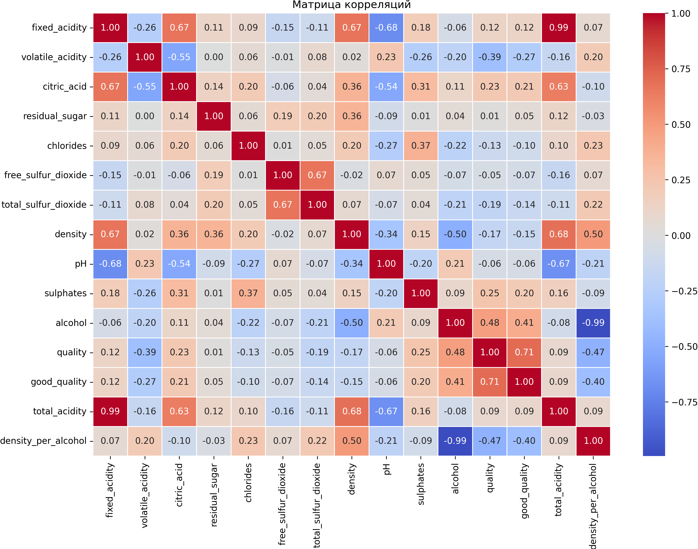

# Отчет об эксперименте: WineQuality_Boosting_[n_est=100_depth=2_lr=0.100]_Wine Quality - Boosting

**Дата генерации:** 2025-12-25 01:04:37

## Основная информация

- **ID задачи:** `aeb5b1e9b2374ced9bfdee23e3bc09d1`
- **Проект:** Wine Quality
- **Статус:** completed
- **Создано:** 2025-12-22T17:53:55.681000+00:00
- **Завершено:** 2025-12-24T16:42:48.448000+00:00
- **Теги:** framework:sklearn, model_type:boosting, task:classification, wine_quality

## Параметры эксперимента

| Параметр | Значение |
|----------|----------|
| `Args/boosting_learning_rate` | `0.1` |
| `Args/boosting_max_depth` | `2` |
| `Args/boosting_n_estimators` | `100` |
| `Args/experiment_name` | `` |
| `Args/mlp_hidden_layer_sizes` | `` |
| `Args/mlp_max_iter` | `` |
| `Args/model_type` | `boosting` |
| `Args/project_name` | `Wine Quality` |
| `Args/quality_threshold` | `7` |
| `Args/random_state` | `42` |
| `Args/rf_max_depth` | `` |
| `Args/rf_n_estimators` | `` |
| `Args/test_size` | `0.2` |
| `General/boosting_learning_rate` | `0.1` |
| `General/boosting_max_depth` | `2` |
| `General/boosting_n_estimators` | `100` |
| `General/model_type` | `boosting` |
| `General/n_features` | `13` |
| `General/n_test` | `320` |
| `General/n_train` | `1279` |
| `General/quality_threshold` | `7` |
| `General/random_state` | `42` |
| `General/test_size` | `0.2` |

## Метрики

| Метрика | Значение |
|---------|----------|
| `Metrics/accuracy` | `0.8969` |
| `Metrics/f1_weighted` | `0.8801` |

## Сравнение экспериментов

### Сравнительная таблица метрик

| Эксперимент | Metrics/accuracy | Metrics/f1_weighted |
|---|---|---|
| WineQuality_Boosting_[n_est=100_depth=2_lr=0.10... | 0.8969 | 0.8801 |
| WineQuality_Randomforest_Wine Quality - Random ... | 0.9375 | 0.9331 |

### График сравнения метрик

## Визуализации

### Графики основного эксперимента

>
>

### Графики эксперимента: WineQuality_Randomforest_Wine Quality - Random ...

>
>
