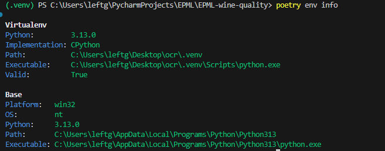

проделанная работа:
1.
а) Создан шаблон на основе DS шаблона, но чуть облегченного https://github.com/LeftGoga/EPML_DS_COOCKIECUTTER.git
б) Создан README с описанием основных команд и файловой структуры
СтруктураЖ
```
└───{{ cookiecutter.project_slug }}
    ├───.github
    ├───data
    ├───models
    ├───notebooks
    ├───plots
    ├───src
    │   └───{{cookiecutter.package_name}}
    └───tests
```
2.
а) Добавил в pyproject.toml настройки для линтеров(взял из интернета наиболее профессиональные, но отключил слишком душные требования для тестового проекта)

**Настройки Линтеров и Форматеров**:
mypy:
```
python_version = "3.13"
warn_unused_configs = true
disallow_untyped_defs = false
disallow_incomplete_defs = false
check_untyped_defs = true
warn_redundant_casts = true
warn_unused_ignores = true
warn_return_any = true
strict_equality = true
extra_checks = true
ignore_missing_imports = true
```
ruff:

line-length = 100
target-version = "py313"
```
select = [
  "E", "W", "F",
  "I",
  "B",
  "C4",
  "UP",
  "ARG",
  "PIE",
  "PL",
  "RUF",
]
ignore = [
  "E501",
  "B008",
  "PLR0913",
  "PLR2004",
  "RUF001",
   "RUF002",
   "RUF003"
]


quote-style = "double"
indent-style = "space"

combine-as-imports = true
known-first-party = ["wine_quality"]
```

б) Создал хуки для коммитов с линтерами и фиксами( Ruff, mypy как наиболее полные и дополняюющие друг друга)
```
repos:
  - repo: https://github.com/astral-sh/ruff-pre-commit
    rev: v0.6.9
    hooks:
      - id: ruff
        args: [--fix, --exit-non-zero-on-fix]
      - id: ruff-format

  - repo: https://github.com/pre-commit/mirrors-mypy
    rev: v1.11.2
    hooks:
      - id: mypy

  - repo: https://github.com/pre-commit/pre-commit-hooks
    rev: v5.0.0
    hooks:
      - id: end-of-file-fixer
      - id: trailing-whitespace
```

В) Добавил в окружение Ruff как форматер
г) Создал makefile для удобства
**MakeFile**:
```
.PHONY: all install run train lint format clean reinstall

all: install run

install:
	poetry install --with dev

run train:
	poetry run python -m wine_quality

format:
	poetry run ruff format src
	poetry run ruff check --select I --fix src

lint:
	-poetry run ruff check src
	-poetry run mypy src

clean:
ifeq ($(OS),Windows_NT)
	@if exist models (rmdir /s /q models)
	@if exist plots (rmdir /s /q plots)
	@if exist .pytest_cache (rmdir /s /q .pytest_cache)
	@if exist .mypy_cache (rmdir /s /q .mypy_cache)
	@if exist .ruff_cache (rmdir /s /q .ruff_cache)
	del /s /q *.pyc 2>NUL
	for /d /r . %%d in (__pycache__) do @if exist "%%d" rmdir /s /q "%%d"
	@echo "Очистка завершена"
else
	rm -rf models/ plots/ __pycache__/ .pytest_cache/ .mypy_cache/ .ruff_cache/
	find . -type f -name "*.pyc" -delete
	find . -type d -name "__pycache__" -exec rm -rf {} +
	@echo "Очистка завершена"
endif
reinstall:
	poetry env remove --all
	poetry install --with dev

```

д) Создал config.py и env для конфигураций


3.
Настроил Poetry с зависимостями

Создал requirements.txt через pip freeze
Создал базовый dockerfile
```
FROM python:3.13-slim

RUN apt-get update && apt-get install -y --no-install-recommends \
    build-essential \
    gcc \
    && rm -rf /var/lib/apt/lists/*

ENV POETRY_VERSION=1.8.3
RUN pip install "poetry==$POETRY_VERSION"

ENV POETRY_VIRTUALENVS_CREATE=false
ENV POETRY_NO_INTERACTION=1

WORKDIR /app

COPY pyproject.toml poetry.lock* ./

RUN poetry install --only main --no-ansi

COPY . .

CMD ["python", "-m", "wine_quality"]
```
4.
Создал гит c ветками под дз
Настроил git ignore на основе обычного gitignore для python
5.
Отчет создан
