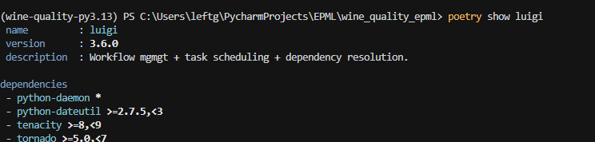
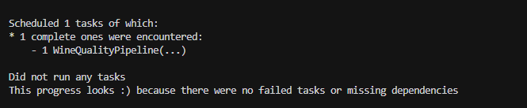
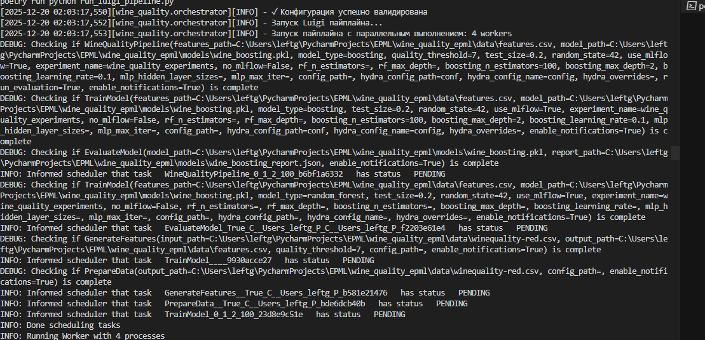
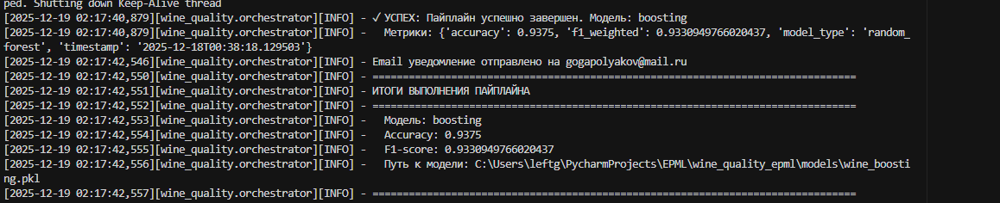
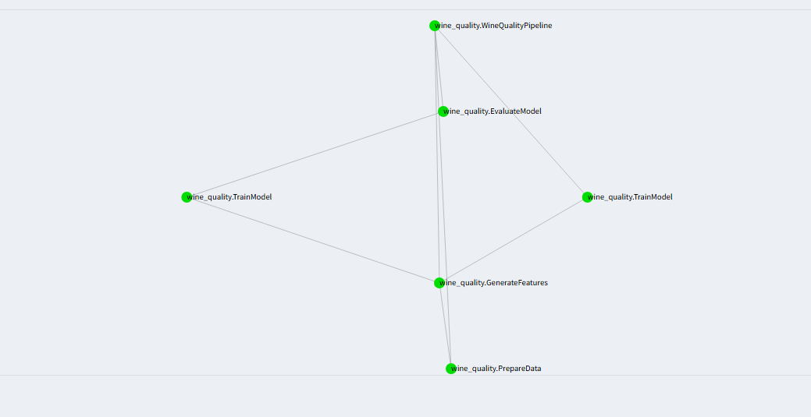
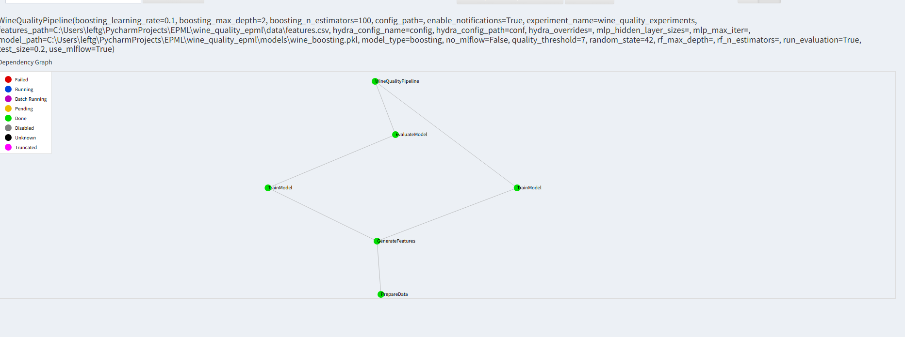
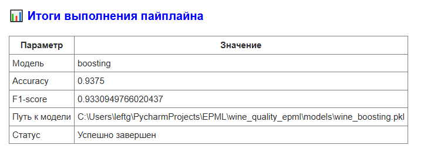
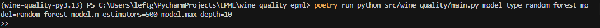
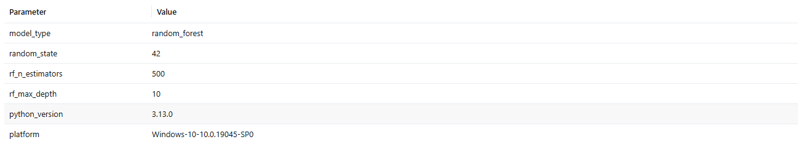

# Отчет по проделанной работе: Интеграция Luigi и Hydra

## Выбранные инструменты

### Для оркестрации пайплайна
**Luigi**

### Для управления конфигурациями
**Hydra**

---

## 1. Настройка выбранного инструмента оркестрации (4 балла)

### a) Установка и настройка Luigi

Luigi установлен через Poetry и добавлен в зависимости проекта:



Luigi интегрирован в проект через модуль `src/wine_quality/luigi_pipeline.py`

### b) Создание workflow для ML пайплайна

Создан полный workflow для ML пайплайна, состоящий из следующих задач:

#### 1. `PrepareData` - Подготовка исходных данных
```76:100:src/wine_quality/luigi_pipeline.py
class PrepareData(luigi.Task):
    output_path = luigi.Parameter(default=str(BASE_DIR / "data" / "winequality-red.csv"))
    config_path = luigi.OptionalParameter(default=None)
    enable_notifications = luigi.BoolParameter(default=True)

    def output(self) -> luigi.LocalTarget:
        return luigi.LocalTarget(self.output_path)

    def run(self) -> None:
        # Загрузка данных, сохранение, уведомления об успехе/ошибке
```

#### 2. `GenerateFeatures` - Генерация признаков
```103:149:src/wine_quality/luigi_pipeline.py
class GenerateFeatures(luigi.Task):
    input_path = luigi.Parameter(default=str(BASE_DIR / "data" / "winequality-red.csv"))
    output_path = luigi.Parameter(default=str(BASE_DIR / "data" / "features.csv"))
    quality_threshold = luigi.IntParameter(default=7)
    config_path = luigi.OptionalParameter(default=None)
    enable_notifications = luigi.BoolParameter(default=True)

    def requires(self) -> PrepareData:
        return PrepareData(
            output_path=self.input_path,
            config_path=self.config_path,
            enable_notifications=self.enable_notifications,
        )

    def run(self) -> None:
        # Генерация признаков из входных данных, создание целевой переменной
```

#### 3. `TrainModel` - Обучение модели
```152:392:src/wine_quality/luigi_pipeline.py
class TrainModel(luigi.Task):
    features_path = luigi.Parameter(default=str(BASE_DIR / "data" / "features.csv"))
    model_path = luigi.Parameter(default=str(BASE_DIR / "models" / "wine_rf.pkl"))
    model_type = luigi.Parameter(default="random_forest")
    # ... другие параметры ...
    hydra_config_path = luigi.OptionalParameter(default=None)
    hydra_config_name = luigi.OptionalParameter(default=None)
    hydra_overrides = luigi.OptionalParameter(default=None)
    enable_notifications = luigi.BoolParameter(default=True)

    def _load_hydra_config(self) -> DictConfig | None:
        # Загрузка конфигурации Hydra через hydra.initialize()

    def run(self) -> None:
        # Загрузка конфигурации, подготовка данных, обучение модели, сохранение метрик
```

#### 4. `EvaluateModel` - Оценка модели
```395:445:src/wine_quality/luigi_pipeline.py
class EvaluateModel(luigi.Task):
    model_path = luigi.Parameter(default=str(BASE_DIR / "models" / "wine_rf.pkl"))
    report_path = luigi.Parameter(default=str(BASE_DIR / "outputs" / "evaluation_report.json"))
    enable_notifications = luigi.BoolParameter(default=True)

    def requires(self) -> TrainModel:
        return TrainModel(model_path=self.model_path, enable_notifications=self.enable_notifications)

    def run(self) -> None:
        # Загрузка метрик, создание отчета об оценке
```

#### 5. `WineQualityPipeline` - Главная задача пайплайна
```448:548:src/wine_quality/luigi_pipeline.py
class WineQualityPipeline(luigi.WrapperTask):
    # Параметры для всех этапов пайплайна
    features_path = luigi.Parameter(default=str(BASE_DIR / "data" / "features.csv"))
    model_path = luigi.Parameter(default=str(BASE_DIR / "models" / "wine_rf.pkl"))
    model_type = luigi.Parameter(default="random_forest")
    # ... другие параметры ...

    def requires(self) -> list[luigi.Task]:
        # Создание списка задач: TrainModel и опционально EvaluateModel

    def on_success(self) -> None:
        # Отправка итогового уведомления об успешном завершении

    def on_failure(self, exception: Exception) -> None:
        # Отправка уведомления об ошибке
```

**Особенности реализации:**
- Каждая задача интегрирована с системой уведомлений
- Задачи логируют время выполнения и метрики
- Обработка ошибок с уведомлениями о сбоях
- Главная задача имеет обработчики `on_success()` и `on_failure()` для финальных уведомлений

### c) Настройка зависимостей между этапами

Зависимости между задачами настроены через метод `requires()`:

```
PrepareData
    ↓
GenerateFeatures (requires: PrepareData)
    ↓
TrainModel (requires: GenerateFeatures)
    ↓
EvaluateModel (requires: TrainModel)
    ↓
WineQualityPipeline (requires: EvaluateModel)
```

Luigi автоматически определяет порядок выполнения задач на основе зависимостей и выполняет только те задачи, выходные файлы которых отсутствуют или устарели.

### d) Реализация кэширования и параллельного выполнения

#### Кэширование

Кэширование реализовано через механизм `output()` в Luigi. Каждая задача определяет свои выходные файлы:

Каждая задача определяет выходные файлы через метод `output()` для реализации кэширования.

Luigi автоматически проверяет существование выходных файлов и пропускает выполнение задачи, если файлы уже существуют и актуальны.


#### Параллельное выполнение

Параллельное выполнение настроено через параметры `luigi.build()`:

```128:144:src/wine_quality/orchestrator.py
def _prepare_build_params(cfg: DictConfig) -> dict[str, Any]:
    # Определение типа планировщика (local/central)
    # Настройка количества workers для параллельного выполнения
    # Возврат параметров для luigi.build()
```

Конфигурация параллельного выполнения задается в `conf/pipeline/pipeline_luigi.yaml`:

```yaml
pipeline:
  runner: luigi
  parallel: true
  workers: 4
  scheduler: central  # или local
  log_level: INFO
  force_rerun: false

monitoring:
  enabled: true
  log_dir: outputs/pipeline_logs

notifications:
  enabled: true
  email:
    enabled: false
    smtp_host: null
    smtp_user: null
    recipient_email: null
```

**Поддерживаемые планировщики:**
- `local` - локальный планировщик (по умолчанию)
- `central` - центральный планировщик Luigi (требует запущенного `luigid`)

---




## 2. Настройка выбранного инструмента конфигураций (3 балла)

### a) Настройка Hydra для управления конфигурациями

Hydra установлен через Poetry:

```toml
hydra-core = "^1.3.2"
```

Hydra интегрирован в проект через декоратор `@hydra.main()` в модуле `src/wine_quality/orchestrator.py`:

```python
@hydra.main(
    config_path=str(BASE_DIR / "conf"),
    config_name="config",
    version_base=None,
)
def run_pipeline_with_hydra(cfg: DictConfig) -> None:
    """Запускает Luigi пайплайн с конфигурацией из Hydra."""
    # ...
```

### b) Создание конфигураций для разных алгоритмов

Создана иерархическая структура конфигураций в директории `conf/`:

#### Конфигурации моделей (`conf/model/`)

**Random Forest:**
- `random_forest.yaml` - базовая конфигурация
- `random_forest_fast.yaml` - быстрая конфигурация (меньше деревьев)
- `random_forest_deep.yaml` - глубокая конфигурация (больше деревьев, больше глубина)

**Boosting:**
- `boosting.yaml` - базовая конфигурация
- `boosting_fast.yaml` - быстрая конфигурация
- `boosting_deep.yaml` - глубокая конфигурация

**MLP:**
- `mlp.yaml` - базовая конфигурация
- `mlp_small.yaml` - маленькая сеть
- `mlp_large.yaml` - большая сеть

#### Конфигурации данных (`conf/data/`)

- `data.yaml` - базовая конфигурация
- `data_small.yaml` - небольшой датасет
- `data_large.yaml` - большой датасет
- `data_strict.yaml` - строгий порог качества
- `data_lenient.yaml` - мягкий порог качества

#### Конфигурации окружения (`conf/env/`)

- `dev.yaml` - конфигурация для разработки
- `test.yaml` - конфигурация для тестирования
- `prod.yaml` - конфигурация для продакшена

#### Конфигурации пайплайна (`conf/pipeline/`)

- `pipeline_luigi.yaml` - параллельное выполнение
- `pipeline_sequential.yaml` - последовательное выполнение

### c) Настройка валидации конфигураций

Валидация конфигураций реализована через Pydantic схемы в модуле `src/wine_quality/config_schema.py`:

```python
class ModelConfig(BaseModel):
    n_estimators: int | None = Field(default=None, ge=1, le=10000)
    max_depth: int | None = Field(default=None, ge=1, le=100)
    learning_rate: float | None = Field(default=None, gt=0.0, le=1.0)
    # ... другие параметры моделей

class DataConfig(BaseModel):
    data_url: str = Field(description="URL для загрузки данных")
    test_size: float = Field(ge=0.0, lt=1.0)
    quality_threshold: int = Field(ge=1, le=10)

class AppConfig(BaseModel):
    model_type: Literal["random_forest", "boosting", "mlp"]
    random_state: int = Field(ge=0)
    model: ModelConfig
    data: DataConfig
    mlflow: MLflowConfig
    paths: PathsConfig
```

Валидация выполняется в функции `run_pipeline_with_hydra()`:

```python
cfg_dict = OmegaConf.to_container(cfg, resolve=True)
if "env" in cfg_dict and cfg_dict["env"] is None:
    del cfg_dict["env"]
validated_cfg = AppConfig(**cfg_dict)
logger.info("✓ Конфигурация успешно валидирована")
```

### d) Создание системы композиции конфигураций

Композиция конфигураций реализована через механизм `defaults` в Hydra:

```yaml
# conf/config_luigi.yaml
# @package _global_

defaults:
  - _self_
  - model: random_forest
  - data: data
  - mlflow: mlflow
  - paths: paths
  - pipeline: pipeline_luigi
  - env: null

model_type: random_forest
random_state: 42
```

Это позволяет легко переключаться между различными конфигурациями:

```bash
# Запуск с базовой конфигурацией Random Forest
python run_luigi_pipeline.py

# Запуск с быстрой конфигурацией Random Forest
python run_luigi_pipeline.py model=random_forest_fast

# Запуск с глубокой конфигурацией Boosting
python run_luigi_pipeline.py model=boosting_deep data=data_strict

# Запуск с последовательным выполнением
python run_luigi_pipeline.py pipeline=pipeline_sequential
```

---

## 3. Интеграция и тестирование (2 балла)

### a) Интеграция выбранных инструментов

Интеграция Luigi и Hydra реализована в модуле `src/wine_quality/orchestrator.py`:

```155:206:src/wine_quality/orchestrator.py
@hydra.main(config_path=str(BASE_DIR / "conf"), config_name="config", version_base=None)
def run_pipeline_with_hydra(cfg: DictConfig) -> None:
    # Валидация конфигурации через Pydantic
    # Преобразование конфигурации Hydra в параметры Luigi
    # Создание и запуск Luigi задачи с мониторингом и уведомлениями
```

Конфигурация Hydra передается в Luigi задачи через параметры `hydra_config_path`, `hydra_config_name` и `hydra_overrides`, что позволяет задачам Luigi загружать и использовать те же конфигурации.

**Особенности интеграции:**
- Конфигурация передается через параметры `hydra_config_path`, `hydra_config_name` и `hydra_overrides`
- Задачи Luigi могут загружать и использовать конфигурацию Hydra через метод `_load_hydra_config()`
- Параметры моделей из Hydra автоматически преобразуются в параметры Luigi задач
- Поддержка всех типов моделей (Random Forest, Boosting, MLP) с соответствующими параметрами

### b) Создание системы мониторинга выполнения

Реализован класс `PipelineMonitor` для мониторинга выполнения пайплайна:

```21:58:src/wine_quality/orchestrator.py
class PipelineMonitor:
    def log_task_start(self, task_name: str, params: dict[str, Any]) -> None:
        # Логирование начала выполнения задачи с параметрами

    def log_task_complete(self, task_name: str, metrics: dict[str, Any] | None = None) -> None:
        # Логирование успешного завершения с метриками

    def log_task_failure(self, task_name: str, error: str) -> None:
        # Логирование ошибки выполнения

    def _write_log(self, entry: dict[str, Any]) -> None:
        # Сохранение логов в JSON файлы с временными метками в имени файла
```

**Особенности мониторинга:**
- Логи сохраняются в JSON формате в директории `outputs/pipeline_logs/` с временными метками в имени файла
- Каждое событие (старт, завершение, ошибка) записывается в отдельный файл с временной меткой
- Логи содержат параметры задач, метрики и информацию об ошибках
- Мониторинг можно включить/выключить через конфигурацию `monitoring.enabled`





### c) Настройка уведомлений о результатах

Реализован класс `NotificationSystem` для уведомлений о результатах выполнения с поддержкой email уведомлений:

```45:72:src/wine_quality/luigi_pipeline.py
class NotificationSystem:
    def __init__(self, enabled: bool = True, email_enabled: bool = False, ...):
        # Инициализация системы уведомлений

    def _send_email(self, subject: str, body: str, is_html: bool = False) -> None:
        # Отправка email через SMTP (поддержка SSL/TLS, обработка ошибок аутентификации)

    def notify_success(self, message: str, metrics: dict[str, Any] | None = None) -> None:
        # Логирование и отправка email об успешном выполнении

    def notify_failure(self, message: str, error: str | None = None) -> None:
        # Логирование и отправка email об ошибке

    def notify_completion(self, summary: dict[str, Any]) -> None:
        # Итоговое уведомление с метриками пайплайна
```

**Особенности системы уведомлений:**
- **Логирование в консоль** - все уведомления выводятся в логи
- **Email уведомления** - поддержка отправки HTML уведомлений через SMTP
- **Настройка через переменные окружения** - `SMTP_HOST`, `SMTP_PORT`, `SMTP_USER`, `SMTP_PASSWORD`, `RECIPIENT_EMAIL`
- **Настройка через конфигурацию** - секция `notifications.email` в конфигурации пайплайна
- **Поддержка разных SMTP серверов** - Gmail, Mail.ru, Yandex с автоматическим определением настроек
- **Обработка ошибок аутентификации** - информативные сообщения с ссылками на создание паролей приложений
- **HTML форматирование** - красиво оформленные email с таблицами и цветовой индикацией




### d) Тестирование воспроизводимости

Воспроизводимость обеспечивается через:

1. **Фиксация random_state** в конфигурации:
```yaml
random_state: 42
```

2. **Версионирование зависимостей** через Poetry (`poetry.lock`)

3. **Логирование всех параметров** в MLflow и локальные файлы метрик

4. **Кэширование результатов** через Luigi - при повторном запуске с теми же параметрами задачи не перевыполняются

Пример выполнения пайплайна:

```bash
python run_luigi_pipeline.py model=random_forest

python run_luigi_pipeline.py model=random_forest
```

Результаты выполнения сохраняются в:
- `models/wine_<model_type>.pkl` - обученная модель
- `models/wine_<model_type>_metrics.json` - метрики модели
- `models/wine_<model_type>_report.json` - отчет о модели
- `outputs/pipeline_logs/` - логи выполнения пайплайна

**Дополнительные улучшения:**
- Улучшенное логирование с фильтрацией дублирующихся сообщений в `run_luigi_pipeline.py`
- Поддержка центрального планировщика Luigi (`scheduler: central`) для распределенного выполнения
- Параметр `force_rerun` для принудительного перевыполнения задач
- Детальная обработка ошибок на каждом этапе пайплайна
- Автоматическое создание директорий для выходных файлов

---




## Подготовлен отчет
Настоящий документ является финальным отчетом.
