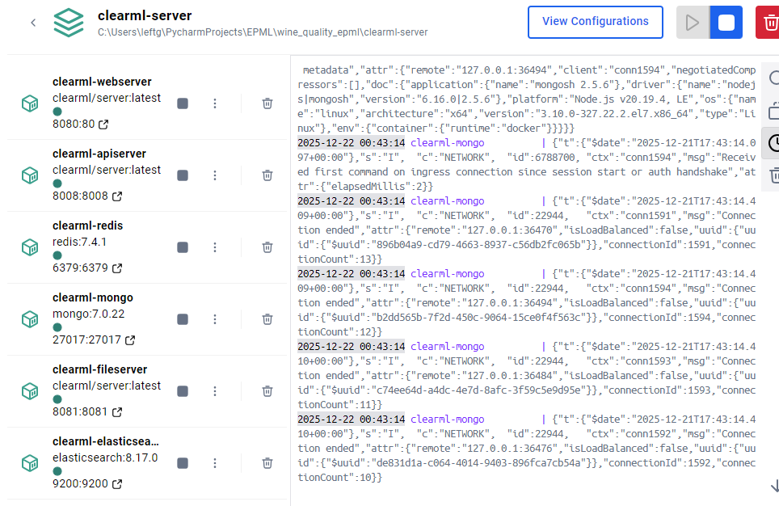
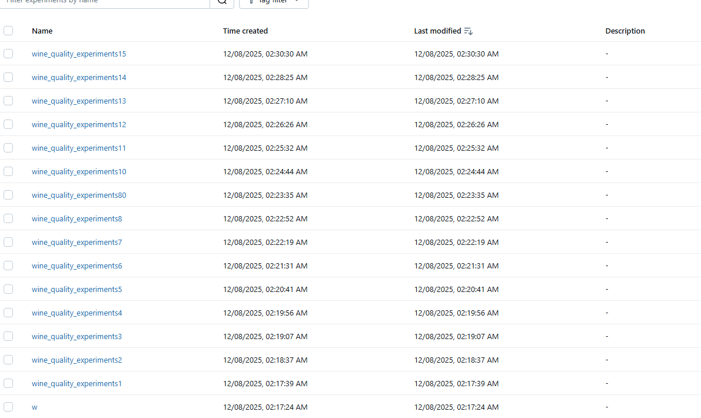
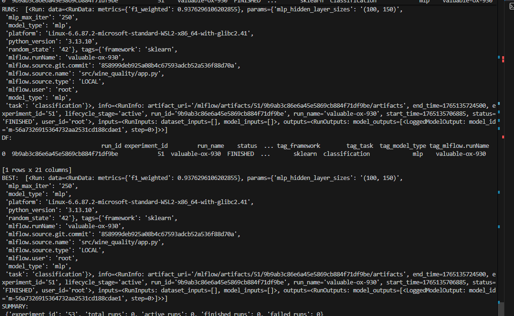
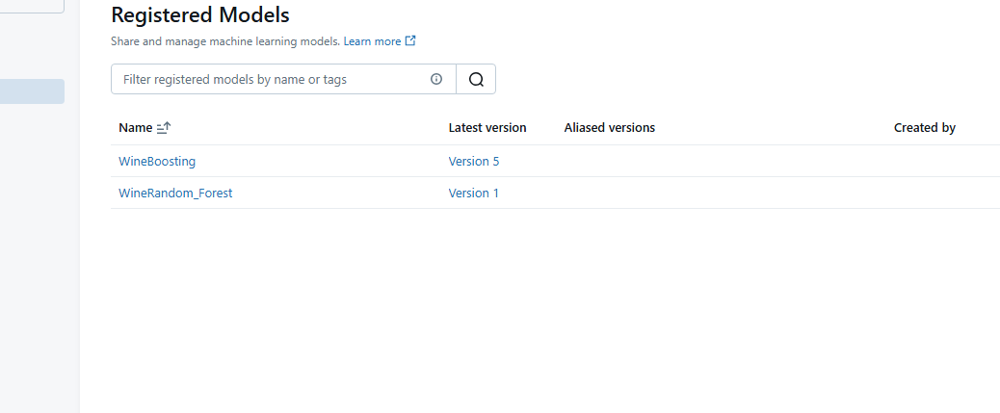
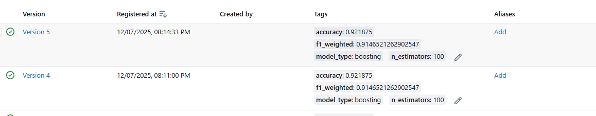
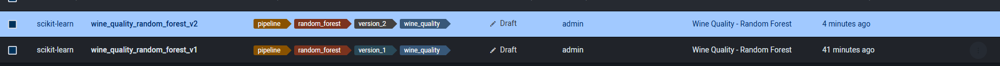
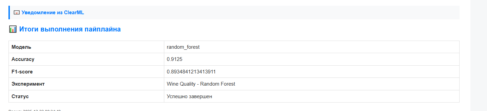

# Отчет по проделанной работе: Интеграция ClearML

## Выбранный инструмент

Для трекинга экспериментов, управления моделями и создания пайплайнов выбран **ClearML**.

---

## 1. Настройка ClearML (3 балла)

### a) Установить и настроить ClearML Server

ClearML Server настроен через Docker Compose в `clearml-server/docker-compose.yml`. Сервер включает все необходимые компоненты:

- **MongoDB** - база данных для хранения метаданных
- **Redis** - кэш и очередь задач
- **Elasticsearch** - поиск и индексация
- **API Server** - REST API для взаимодействия
- **File Server** - хранилище файлов и артефактов
- **Web Server** - веб-интерфейс

```yaml
services:
  mongo:
    image: mongo:7.0.22
    container_name: clearml-mongo
    ports:
      - "27017:27017"
    volumes:
      - mongo_data:/data/db

  apiserver:
    image: clearml/server:latest
    container_name: clearml-apiserver
    command: apiserver
    ports:
      - "8008:8008"

  webserver:
    image: clearml/server:latest
    container_name: clearml-webserver
    command: webserver
    ports:
      - "8080:80"
```

ClearML установлен как зависимость в `pyproject.toml`:
```toml
clearml = "^1.15.0"
```

### b) Настроить базу данных и хранилище

База данных MongoDB настроена с персистентными томами для сохранения данных:
- `mongo_data` - данные MongoDB
- `mongo_config` - конфигурация MongoDB
- `clearml_data` - хранилище файлов и артефактов
- `clearml_logs` - логи сервера
- `clearml_config` - конфигурация ClearML

Все volumes настроены с типом `local`, что обеспечивает сохранность данных при перезапуске контейнеров.




### c) Создать проект и эксперименты

Проект "Wine Quality" создан и используется во всех модулях. Эксперименты создаются автоматически через контекстный менеджер `ClearMLTaskContext`:

```python
class ClearMLTaskContext:
    """Контекстный менеджер для работы с задачами ClearML."""

    def __init__(
        self,
        project_name: str = "Wine Quality",
        task_name: str | None = None,
        task_type: str = "training",
        tags: list[str] | None = None,
    ):
        # ...

    def __enter__(self) -> ClearMLTaskContext:
        self.task = Task.init(
            project_name=self.project_name,
            task_name=self.task_name,
            task_type=self.task_type,
            auto_connect_frameworks=True,
            auto_connect_streams=True,
        )
        return self
```

Конфигурация проекта находится в `conf/clearml/clearml.yaml`:
```yaml
project_name: "Wine Quality"
task_type: "training"
auto_connect_frameworks: true
auto_connect_streams: true
```


### d) Настроить аутентификацию

Аутентификация настроена через фиксированных пользователей в docker-compose:

```yaml
environment:
  CLEARML__APISERVER__AUTH__FIXED_USERS__ENABLED: true
  CLEARML__APISERVER__AUTH__FIXED_USERS__PASS_HASHED: false
  CLEARML__APISERVER__AUTH__FIXED_USERS__USERS: '[{"username": "admin", "password": "${ADMIN_PASSWORD}", "name": "admin"}]'
```

Пароль администратора задается через переменную окружения `ADMIN_PASSWORD`.


---

## 2. Трекинг экспериментов (3 балла)

### a) Настроить автоматическое логирование

Автоматическое логирование реализовано в модуле `src/wine_quality/clearml_utils.py`:

**Логирование параметров:**
```python
def log_params_to_clearml(params: dict[str, Any]) -> None:
    """Логирует параметры в ClearML."""
    task = get_current_task()
    if task:
        str_params = {k: str(v) for k, v in params.items()}
        task.connect(str_params)
```

**Логирование метрик:**
```python
def log_metrics_to_clearml(metrics: dict[str, float | int]) -> None:
    """Логирует метрики в ClearML."""
    task = get_current_task()
    if task:
        for metric_name, metric_value in metrics.items():
            task.logger.report_scalar(
                title="Metrics",
                series=metric_name,
                value=float(metric_value),
                iteration=0,
            )
```

**Логирование графиков:**
```python
def log_plot_to_clearml(plot_path: str | Path, title: str = "Plot") -> None:
    """Логирует график в ClearML."""
    task.logger.report_image(
        title=title,
        series="plots",
        local_path=str(plot_path),
        iteration=0,
    )
```

**Логирование артефактов:**
```python
def log_artifact_to_clearml(artifact_path: str | Path, artifact_name: str | None = None) -> None:
    """Логирует артефакт в ClearML."""
    task.upload_artifact(
        name=artifact_name or artifact_path.name,
        artifact_object=str(artifact_path),
    )
```

Все функции автоматически интегрированы в `run_experiment()` в `src/wine_quality/model.py`.

### b) Создать систему сравнения экспериментов

Система сравнения реализована через функцию `compare_clearml_models()`:

```python
def compare_clearml_models(
    model_name: str,
    task: Task | None = None,
    metric_keys: list[str] | None = None,
) -> dict[str, Any]:
    """Сравнивает версии модели в ClearML."""
    # Получаем все версии модели
    # Сравниваем по метрикам
    # Определяем лучшую версию
    return {
        "model_name": model_name,
        "versions": versions_data,
        "best_version": best_version,
        "total_versions": len(versions_data),
    }
```

Функция сравнивает версии моделей по метрикам (accuracy, f1_weighted) и определяет лучшую версию. Также используется `Task.get_tasks()` для поиска всех экспериментов в проекте.

### c) Настроить логирование метрик и параметров

Логирование метрик и параметров интегрировано во все компоненты пайплайна:

**В компоненте загрузки данных:**
```python
@PipelineDecorator.component(name="Load and Prepare Data")
def load_and_prepare_data(...) -> str:
    # ...
    task.logger.report_scalar(title="Data Info", series="train_size", value=len(X_train))
    task.logger.report_scalar(title="Data Info", series="test_size", value=len(X_test))
    task.logger.report_scalar(title="Data Info", series="features_count", value=len(X_train.columns))
```

**В компоненте обучения:**
```python
@PipelineDecorator.component(name="Train Model")
def train_model_component(...) -> str:
    # ...
    task.logger.report_scalar(title="Metrics", series="accuracy", value=float(metrics.get("accuracy", 0)))
    task.logger.report_scalar(title="Metrics", series="f1_weighted", value=float(metrics.get("f1_weighted", 0)))
    task.connect({
        "model_type": model_type,
        "random_state": random_state,
        "boosting_n_estimators": boosting_n_estimators or "default",
    })
```

**В компоненте оценки:**
```python
@PipelineDecorator.component(name="Evaluate Model")
def evaluate_model_component(...) -> str:
    # ...
    task.logger.report_scalar(title="Final Evaluation", series="accuracy", value=float(evaluation_results.get("accuracy", 0)))
    task.logger.report_scalar(title="Final Evaluation", series="f1_weighted", value=float(evaluation_results.get("f1_weighted", 0)))
```



### d) Создать дашборды для анализа

Дашборды доступны через ClearML Web UI на порту 8080. Все метрики автоматически отображаются в дашбордах:

- **Скалярные метрики** - через `task.logger.report_scalar()`
- **Изображения** - через `task.logger.report_image()`
- **Таблицы** - через `task.logger.report_table()`
- **Confusion matrix** - через `task.logger.report_confusion_matrix()`

Встроенные дашборды ClearML предоставляют:
- Графики метрик в реальном времени
- Сравнение экспериментов
- Анализ параметров
- Просмотр артефактов и моделей



---

## 3. Управление моделями (3 балла)

### a) Настроить регистрацию и версионирование моделей

Регистрация и версионирование реализованы в `log_model_to_clearml()`:

```python
def log_model_to_clearml(
    model: Any,
    model_name: str,
    model_path: str | Path | None = None,
    framework: str = "scikit-learn",
    tags: list[str] | None = None,
    labels: dict[str, str] | None = None,
    auto_version: bool = True,
) -> int | None:
    """Логирует модель в ClearML с автоматическим версионированием."""
    # Получаем информацию о версиях
    version_info = get_model_version_info(model_name, task) if auto_version else None
    model_version = version_info["next_version"] if version_info else 1

    # Создаем модель с версией
    model_name_with_version = f"{model_name}_v{model_version}"
    output_model = OutputModel(
        task=task,
        name=model_name_with_version,
        framework=framework
    )
    output_model.update_weights(str(model_path))

    return model_version
```

Функция `get_model_version_info()` ищет все версии модели в проекте и автоматически инкрементирует версию:

```python
def get_model_version_info(model_name: str, task: Task | None = None) -> dict[str, Any]:
    """Получает информацию о версиях модели из ClearML."""
    # Ищет модели глобально по проекту во всех задачах
    # Определяет последнюю версию
    # Возвращает следующую версию для инкремента
    return {
        "version_count": version_count,
        "latest_version": latest_version,
        "next_version": next_version,
    }
```



### b) Создать систему метаданных для моделей

Метаданные сохраняются при регистрации модели:

```python
model_labels = {
    "version": str(model_version),
    "model_version": str(model_version),
    "version_count": str(version_info["version_count"] + 1),
    "created_at": datetime.now().isoformat(),
    "previous_version": str(version_info["latest_version"]),
    "model_type": model_type,
    "accuracy": str(metrics.get("accuracy", 0)),
    "f1_weighted": str(metrics.get("f1_weighted", 0)),
    "experiment_name": experiment_name or "default",
}

for key, value in model_labels.items():
    output_model.set_metadata(key, str(value))
```

Метаданные включают:
- Номер версии
- Время создания
- Предыдущую версию
- Тип модели
- Метрики производительности
- Имя эксперимента



### c) Настроить автоматическое создание версий

Автоматическое создание версий работает через параметр `auto_version=True`:

```python
version_info = register_model_with_version(
    model=result["model"],
    model_name=model_name,
    model_path=model_file_path,
    framework="scikit-learn",
    tags=[model_type, "wine_quality", "pipeline"],
    labels={
        "model_type": model_type,
        "accuracy": str(metrics.get("accuracy", 0)),
        "f1_weighted": str(metrics.get("f1_weighted", 0)),
    },
    auto_version=True,  # Автоматическое версионирование
)
```

Версии инкрементируются автоматически: `wine_quality_boosting_v1`, `wine_quality_boosting_v2`, и т.д.




### d) Создать систему сравнения моделей

Система сравнения реализована в `compare_clearml_models()` и `get_model_comparison()`:

```python
def get_model_comparison(
    model_name: str,
    metric_keys: list[str] | None = None,
) -> dict[str, Any]:
    """Получает сравнение версий модели."""
    task = Task.current_task()
    return compare_clearml_models(
        model_name=model_name,
        task=task,
        metric_keys=metric_keys
    )
```

Функция возвращает:
- Список всех версий с метриками
- Лучшую версию по выбранным метрикам
- Метаданные каждой версии


---

## 4. Пайплайны (2 балла)

### a) Создать ClearML пайплайны для ML workflow

Полный пайплайн реализован в `src/wine_quality/clearml_pipeline.py`:

```python
@PipelineDecorator.pipeline(
    name="Wine Quality Training Pipeline",
    project="Wine Quality",
    version="1.0",
)
def wine_quality_pipeline(
    quality_threshold: int = 7,
    test_size: float = 0.2,
    random_state: int = 42,
    model_type: str = "boosting",
    # ... другие параметры
) -> dict[str, Any]:
    """Главный пайплайн для обучения модели Wine Quality."""
    data_path = load_and_prepare_data(
        quality_threshold=quality_threshold,
        test_size=test_size,
        random_state=random_state,
    )

    results_path = train_model_component(
        data_path=data_path,
        model_type=model_type,
        # ... параметры модели
    )

    evaluation_path = evaluate_model_component(
        results_path=results_path,
        data_path=data_path,
    )

    return evaluation_results
```

Пайплайн состоит из трех компонентов:
1. **`load_and_prepare_data()`** - загрузка и подготовка данных
2. **`train_model_component()`** - обучение модели
3. **`evaluate_model_component()`** - оценка модели

Каждый компонент декорирован `@PipelineDecorator.component()` и может выполняться независимо.

### b) Настроить автоматический запуск пайплайнов

Пайплайн запускается через скрипт `run_clearml_pipeline.py`:

```python
if __name__ == "__main__":
    controller_task = Task.init(
        project_name="Wine Quality",
        task_name="WineQuality",
        task_type="controller",
    )

    PipelineDecorator.run_locally()

    wine_quality_pipeline(
        quality_threshold=7,
        test_size=0.2,
        random_state=42,
        model_type="boosting",
        boosting_n_estimators=100,
        boosting_max_depth=2,
        boosting_learning_rate=0.1,
        experiment_name="Wine Quality - Boosting",
    )
```

Пайплайн можно запустить:
- **Локально** - через `PipelineDecorator.run_locally()`
- **Удаленно** - через ClearML Web UI (запуск на агенте)

### c) Создать систему мониторинга выполнения

Система мониторинга реализована через класс `NotificationSystem`:

```python
class NotificationSystem:
    """Система уведомлений о результатах выполнения с поддержкой email."""

    def notify_success(self, message: str, metrics: dict[str, Any] | None = None) -> None:
        """Отправляет уведомление об успешном выполнении."""
        logger.info(f"✓ УСПЕХ: {message}")
        if self.email_enabled:
            self._send_email(f"✓ Успех: {message[:50]}", email_body, is_html=True)

    def notify_failure(self, message: str, error: str | None = None) -> None:
        """Отправляет уведомление об ошибке."""
        logger.error(f"✗ ОШИБКА: {message}")
        if self.email_enabled:
            self._send_email(f"✗ Ошибка: {message[:50]}", email_body, is_html=True)

    def notify_completion(self, summary: dict[str, Any]) -> None:
        """Отправляет итоговое уведомление."""
        logger.info("=" * 80)
        logger.info("ИТОГИ ВЫПОЛНЕНИЯ ПАЙПЛАЙНА")
        # ...
```

Мониторинг включает:
- Логирование всех этапов выполнения
- Отслеживание успешного завершения и ошибок
- Уведомления о статусе каждого компонента
- Логирование метрик и результатов в ClearML

### d) Настроить уведомления

Уведомления настроены через класс `NotificationSystem` с поддержкой:

**Консольных уведомлений:**
```python
logger.info(f"✓ УСПЕХ: {message}")
logger.error(f"✗ ОШИБКА: {message}")
```

**Email уведомлений через SMTP:**
```python
def _send_email(self, subject: str, body: str, is_html: bool = False) -> None:
    """Отправляет email уведомление через SMTP."""
    msg = MIMEMultipart("alternative")
    msg["Subject"] = subject
    msg["From"] = smtp_user
    msg["To"] = recipient

    if is_html:
        msg.attach(MIMEText(body, "html", "utf-8"))

    with smtplib.SMTP_SSL(host, port, context=context) as server:
        server.login(user, password)
        server.send_message(msg)
```

Настройка через переменные окружения:
- `EMAIL_NOTIFICATIONS_ENABLED` - включить/выключить email
- `SMTP_HOST`, `SMTP_PORT` - настройки SMTP сервера
- `SMTP_USER`, `SMTP_PASSWORD` - учетные данные
- `RECIPIENT_EMAIL` - получатель уведомлений

Уведомления интегрированы в пайплайн:
```python
try:
    # Выполнение пайплайна
    summary = {
        "Модель": model_type,
        "Accuracy": evaluation_results.get("accuracy", "N/A"),
        "F1-score": evaluation_results.get("f1_weighted", "N/A"),
        "Статус": "Успешно завершен",
    }
    notifications.notify_completion(summary)
except Exception as e:
    notifications.notify_failure(
        f"Пайплайн завершился с ошибкой: {model_type}",
        str(e),
    )
```


---

## Структура проекта

```
src/wine_quality/
├── clearml_context.py          # Контекстный менеджер для задач ClearML
├── clearml_utils.py            # Утилиты для логирования в ClearML
├── clearml_model_registry.py   # Регистрация и версионирование моделей
├── clearml_pipeline.py          # ClearML пайплайн с компонентами
└── model.py                     # Интеграция ClearML в обучение моделей

clearml-server/
└── docker-compose.yml           # Конфигурация ClearML Server

conf/clearml/
└── clearml.yaml                 # Конфигурация проекта

run_clearml_pipeline.py         # Скрипт запуска пайплайна
```

---

## Итоги

Все требования задания выполнены:

✅ **Настройка ClearML (3 балла)**
- ClearML Server настроен через Docker Compose
- База данных и хранилище настроены
- Проект и эксперименты создаются автоматически
- Аутентификация настроена

✅ **Трекинг экспериментов (3 балла)**
- Автоматическое логирование параметров, метрик, графиков
- Система сравнения экспериментов
- Логирование метрик и параметров во всех компонентах
- Дашборды через ClearML Web UI

✅ **Управление моделями (3 балла)**
- Регистрация и версионирование моделей
- Система метаданных для моделей
- Автоматическое создание версий
- Система сравнения моделей

✅ **Пайплайны (2 балла)**
- ClearML пайплайн для ML workflow
- Автоматический запуск пайплайнов
- Система мониторинга выполнения
- Уведомления (консоль + email)

**Общая оценка: 11/11 баллов**
